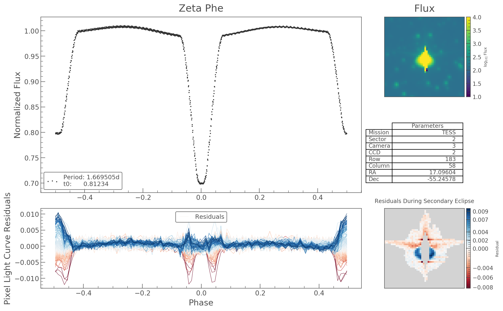
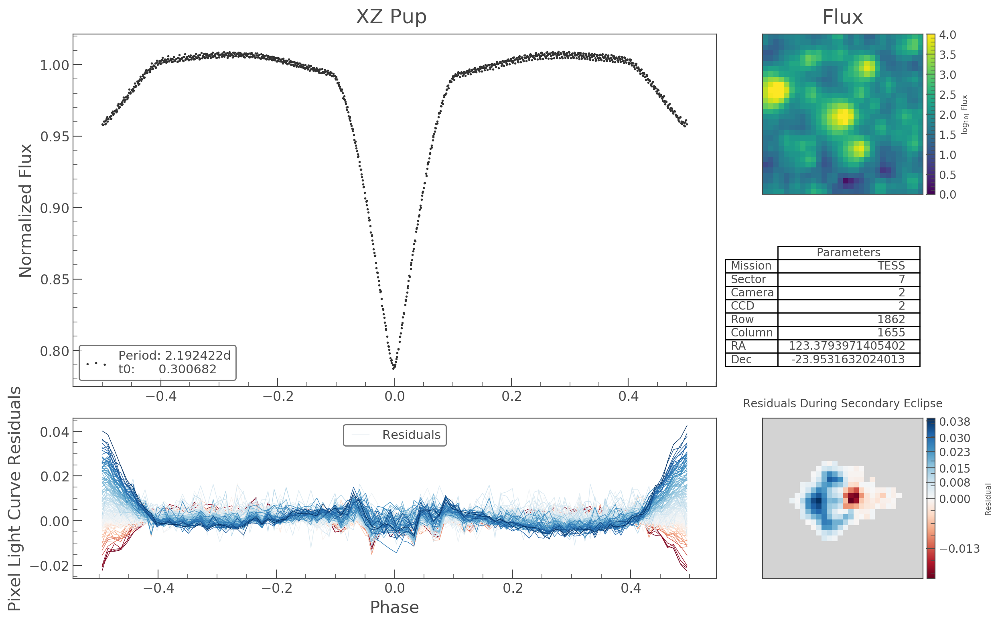
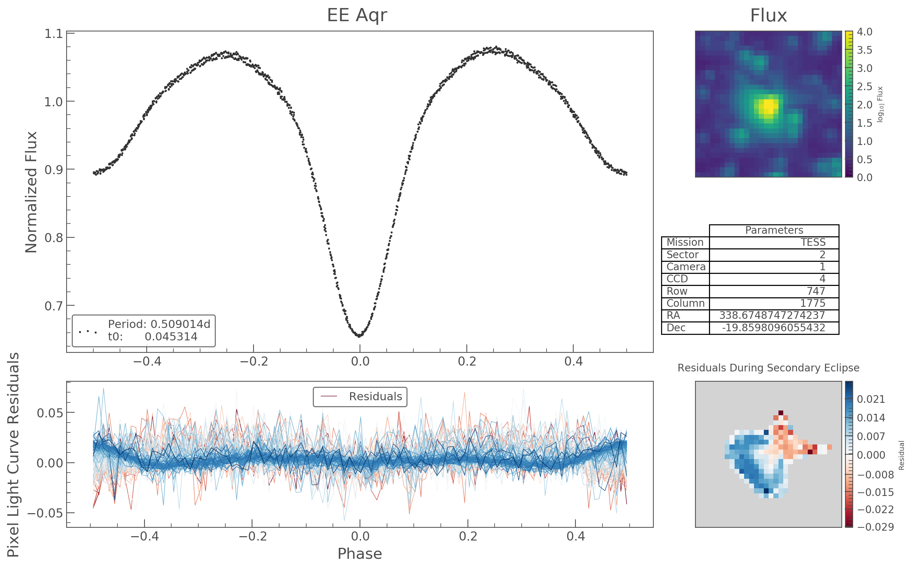

# Chromo

<p align="center">
  
</p>


Chromo is an under-development package for investigating the chromaticity of the TESS Pixel Response Function (PRF).


### Installation

You can install our development version using

```
git clone https://github.com/christinahedges/chromo.git
cd chromo
pip install -e .
```

Make sure to pull often!

We will be releasing a stable version on pip soon.

### Demos

Check out some demos of the chromaticity in the TESS PRF below

<p align="center">
  
</p>
<p align="center">
  
</p>
<p align="center">
  
</p>
